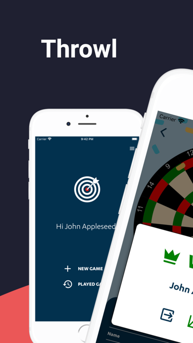
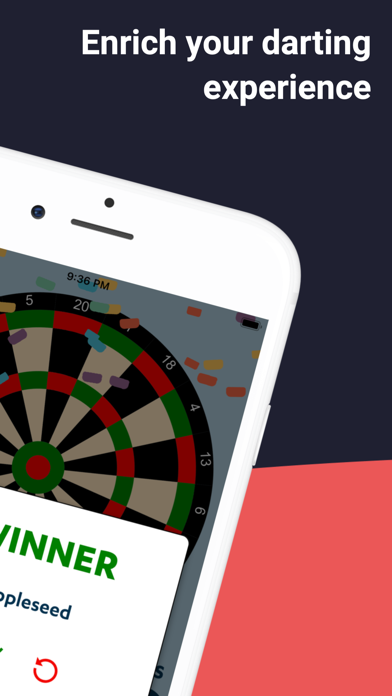
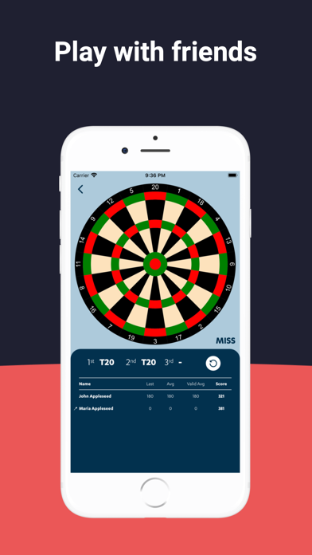
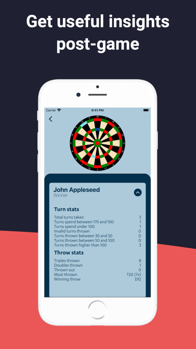

<p align="center">
  
</p>

<h1 align="center">Throwl</h1>

<p align="center">
  A free darts scoring app for keeping track of games with friends and seeing how everyone played.
</p>

<p align="center">
  <a href="https://github.com/bartdelange/throwl/releases/latest"></a>
  <a href="https://github.com/bartdelange/throwl/actions/workflows/code-quality.yml"></a>
  <a href="https://github.com/bartdelange/throwl/actions/workflows/release-throwl.yaml"></a>
  <a href="LICENSE"></a>
</p>

<p align="center">
  <a href="https://apps.apple.com/app/throwl/id1588360439"></a>
  <a href="https://play.google.com/store/apps/details?id=com.throwl"></a>
</p>

## What is Throwl?

Throwl keeps score while you play darts, whether the players are friends with
Throwl accounts or guests sharing the same device. Play a standard x01 game or
practice every double in sequence, then review the result and detailed stats
when the game is over.

Your account keeps a private history of your games. Finished matches can be
revisited for their results, while an unfinished game can be picked up where it
left off.

## Screenshots

<p align="center">
  
  
  
  
</p>

## Features

- Play x01 from 301, 501, or a custom starting score, with a double checkout.
- Practice doubles from D20 down to D1, with options for a shorter match,
  skipping bulls, and ending a turn after an invalid throw.
- Score games for up to eight account holders or local guest players and
  randomize the playing order.
- Add friends by email and invite them into games.
- Record throws on an interactive dartboard and keep a live scoreboard.
- Reopen finished games for results, progress charts, and throw and turn stats.
- Resume unfinished games from the saved game history.

## Open source and contributing

Throwl is open source. Bug reports, contributions, and forks are welcome. For
the complete development guidelines and contributor-owned Firebase setup, see
[CONTRIBUTING.md](CONTRIBUTING.md).

### Requirements

- Node.js `24.18.0` (the version in `.nvmrc`)
- Corepack and pnpm `10.24.0` (declared in `package.json`)
- Android Studio, the Android SDK, and JDK 17 or newer for Android
- Current Xcode command-line tools, Ruby, Bundler, and CocoaPods for iOS

### Install and run

```sh
corepack enable
pnpm install --frozen-lockfile
pnpm nx run @throwl/throwl:start
pnpm nx run @throwl/throwl:run-android
pnpm nx run @throwl/throwl:pod-install
pnpm nx run @throwl/throwl:run-ios
```

The app is built with React Native in an Nx workspace. Inspect all available
targets with `pnpm nx show project @throwl/throwl`.

Firebase platform files are intentionally absent. Create a contributor-owned
Firebase project and follow the [Firebase setup instructions](CONTRIBUTING.md#firebase-contributor-setup)
to add its local configuration. Never commit credentials, production Firebase
files, or signing material.

### Checks

```sh
pnpm lint:check
pnpm typecheck
pnpm test
pnpm test:firestore-rules
pnpm build
pnpm format:check
```

## License and branding

Project-owned source code is licensed under [Apache-2.0](LICENSE). Third-party
components and Jost retain their own licenses; see
[THIRD_PARTY_NOTICES.md](THIRD_PARTY_NOTICES.md).

The Throwl name, logo, app icon, and official store identity are reserved
product branding, as explained in [TRADEMARKS.md](TRADEMARKS.md). Forks are
welcome and should use their own public-facing name, icon, identifiers, and
store listing.
